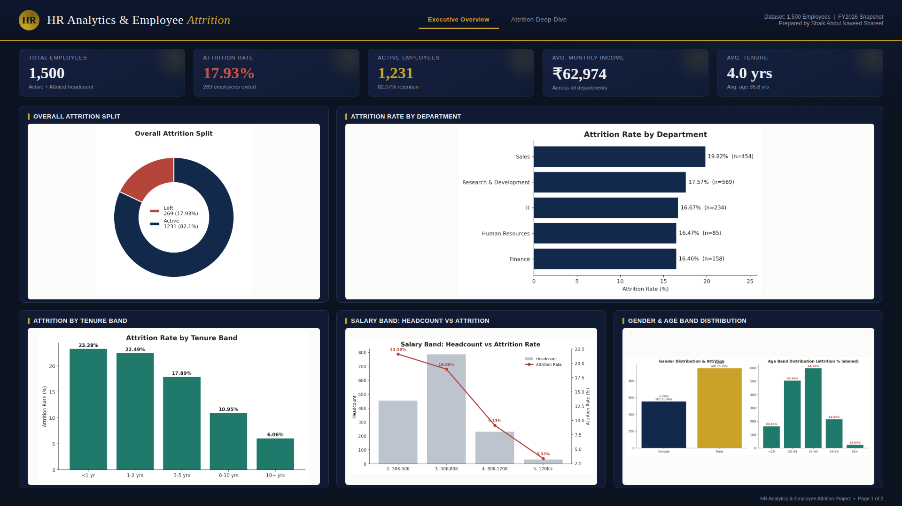
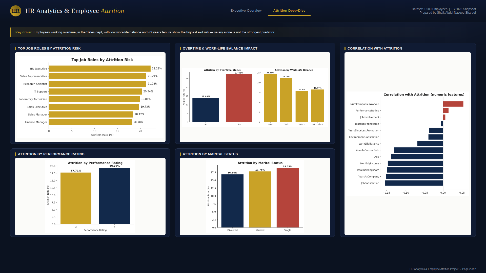

# HR-Analytics-Employee-Attrition
HR Analytics project analyzing employee attrition using SQL Server and Power BI, with insights across departments, salary, tenure, performance, overtime and demographics.
# 📊 HR Analytics & Employee Attrition

An HR Analytics project built using **SQL Server and Power BI** to analyze employee attrition and identify patterns across departments, salary, tenure, overtime, performance, and employee demographics.

---

## 🎯 Project Overview

Employee attrition can significantly affect workforce stability and business performance.

This project analyzes employee-level HR data to identify **where attrition is highest, which employee segments are at greater risk, and what factors are associated with employee turnover**.

The analysis combines SQL-based data analysis with Power BI dashboards to transform raw employee data into actionable HR insights.

---

## 🛠️ Tools & Technologies

- **SQL Server** — Data analysis and business queries
- **Power BI** — Interactive dashboards and visualization
- **DAX** — Calculated measures and KPIs
- **Excel / CSV** — Dataset and data preparation
- **Data Analysis** — Exploratory analysis and business insights

---

## 📌 Business Questions

The project focuses on answering:

- What is the overall employee attrition rate?
- Which departments have the highest attrition?
- Which job roles show higher attrition risk?
- How does employee tenure relate to attrition?
- How does salary level relate to employee attrition?
- Does overtime relate to employee turnover?
- How does work-life balance relate to attrition?
- How does performance rating relate to attrition?
- What patterns can be observed across employee demographics?

---

## 📊 Power BI Dashboard

### Executive Overview



### Attrition Deep-Dive



---

## 📈 Key KPIs

| KPI | Value |
|---|---:|
| Total Employees | 1,500 |
| Attrition Rate | 17.93% |
| Employees Exited | 269 |
| Active Employees | 1,231 |
| Retention Rate | 82.07% |
| Average Monthly Income | ₹62,974 |
| Average Tenure | 4.0 years |

---

## 🔍 Key Findings

### Department Analysis
Sales recorded the highest department-level attrition rate among the departments analyzed.

### Tenure Analysis
Employees with shorter tenure showed substantially higher attrition rates compared with long-tenured employees.

### Salary Analysis
Lower salary bands showed higher attrition rates in the analyzed dataset.

### Overtime Analysis
Employees working overtime showed a higher attrition rate than employees who did not work overtime.

### Work-Life Balance
Attrition varied across work-life balance ratings, indicating a potential relationship between employee experience and turnover.

### Job Role Analysis
Several job roles showed higher attrition rates than the overall employee population and can be considered areas for further HR investigation.

---

## 💡 Business Recommendations

Based on the analysis:

1. **Focus on early-tenure employees**  
   Strengthen onboarding, mentoring, and retention programs during the first few years of employment.

2. **Review overtime patterns**  
   Investigate workload and staffing levels in teams with consistently high overtime and attrition.

3. **Investigate high-risk departments**  
   Conduct deeper analysis of compensation, workload, management, and career progression in high-attrition departments.

4. **Review lower salary bands**  
   Evaluate compensation competitiveness and career progression opportunities for employees in lower salary ranges.

5. **Monitor high-risk job roles**  
   Use regular HR analytics reporting to identify roles experiencing consistently elevated turnover.

---

## 🧮 SQL Analysis

SQL Server was used to perform analysis including:

- Overall attrition rate
- Department-wise attrition
- Job-role analysis
- Salary-band analysis
- Tenure analysis
- Overtime analysis
- Work-life balance analysis
- Performance analysis
- Gender and age analysis
- Employee satisfaction analysis

SQL queries are available in the `sql` folder.

---

## 📂 Project Structure

```text
HR-Analytics-Employee-Attrition/
│
├── README.md
│
├── dashboard/
│   ├── dashboard_page1.png
│   └── dashboard_page2.png
│
├── data/
│   └── employee_attrition.csv
│
├── sql/
│   └── HR_Attrition_Analysis.sql
│
├── powerbi/
│   └── HR_Analytics_Employee_Attrition.pbix
│
└── documentation/
    └── HR_Analytics_Project_Report.pdf
